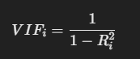

# 🟢 VIF

* **VIF** stands for **Variance Inflation Factor**.
* VIF measures the **impact of multicollinearity** among independent variables in a regression model.
* <mark style="color:purple;background-color:purple;">**Multicollinearity occurs when two or more independent variables are highly correlated, making it hard to isolate the effect of each variable.**</mark>
* High multicollinearity inflates the **standard errors** of the regression coefficients, leading to **unstable estimates**.
* VIF quantifies how much the **variance** of a regression coefficient is **inflated** due to multicollinearity.
*   <mark style="color:purple;background-color:purple;">**The formula for VIF:**</mark>

    <figure><figcaption></figcaption></figure>


* **Interpretation of VIF values**:\
  → **1** = No correlation with other variables.\
  → **1 - 5** = Moderate correlation (acceptable).\
  → **> 5** = High correlation (may require attention).\
  <mark style="color:purple;background-color:purple;">**→ > 10 = Severe multicollinearity (serious concern).**</mark>
* Steps to **calculate VIF** for each variable:\
  → Select one independent variable as the **dependent variable**.\
  → Regress it on all other independent variables.\
  → Obtain the Ri2R\_i^2 from this regression.\
  → Plug Ri2R\_i^2 into the VIF formula.\
  → Repeat the process for all independent variables.
* **Detecting variables causing high VIF**:\
  → Generate a **correlation matrix** to identify **high pairwise correlations**.\
  → Focus on correlation coefficients **above 0.8 or 0.9**.
* **Dealing with high VIF / multicollinearity**:\
  <mark style="color:purple;background-color:purple;">**→ Drop one of the correlated variables (based on domain knowledge or feature importance).**</mark>\ <mark style="color:purple;background-color:purple;">**→ Combine correlated variables if they represent the same concept (e.g., take an average or sum).**</mark>\
  → Use **Principal Component Analysis (PCA)** to create **uncorrelated components**.\
  → Keep the variables but be cautious while interpreting the model (only if both are theoretically important).
* **Combining variables** is helpful when they represent **similar features** (e.g., height in inches and centimeters).
* **PCA** transforms correlated variables into a set of **new uncorrelated variables (principal components)**, which helps reduce multicollinearity.
*   In Python, **VIF can be calculated** using the `variance_inflation_factor` function from the `statsmodels` library.\
    Example:

    ```python
    from statsmodels.stats.outliers_influence import variance_inflation_factor
    import pandas as pd

    X = df[['feature1', 'feature2', 'feature3']]

    vif_data = pd.DataFrame()
    vif_data['Feature'] = X.columns
    vif_data['VIF'] = [variance_inflation_factor(X.values, i) for i in range(X.shape[1])]

    print(vif_data)
    ```
